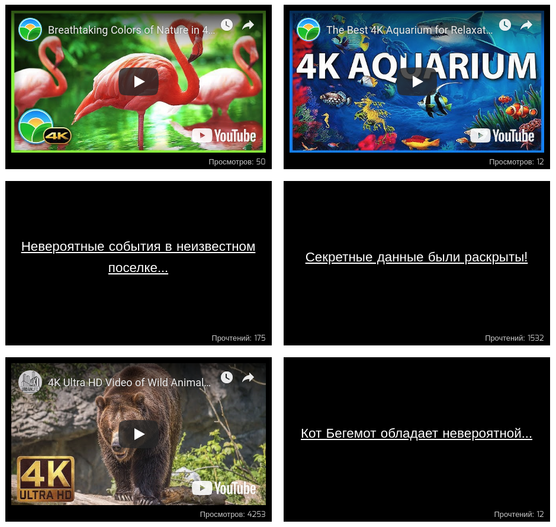

# React + Vite

This template provides a minimal setup to get React working in Vite with HMR and some ESLint rules.

Currently, two official plugins are available:

- [@vitejs/plugin-react](https://github.com/vitejs/vite-plugin-react/blob/main/packages/plugin-react/README.md) uses [Babel](https://babeljs.io/) for Fast Refresh
- [@vitejs/plugin-react-swc](https://github.com/vitejs/vite-plugin-react-swc) uses [SWC](https://swc.rs/) for Fast Refresh

Подсвечивание блоков
===

На нашем сайте есть блоки со статьями и с видеозаписями.

Мы решили улучшить отображение наших блоков таким образом, чтобы популярные статьи и видео, у которых 1000+ прочтений или просмотров,
оборачивались в компонент `Popular`, а с количеством до 100 — в компонент `New`. Эти компоненты будут менять внешний облик блоков, привлекая внимание посетителей.

## Реализация

Используя HOC, обернуть `Video` и `Article` таким образом, чтобы при отображении в компоненте `List` они помещались внутрь требуемого компонента `Popular` или `New`.

Воспользуйтесь готовым файлом `App.js` и стилями `css/index.css` из каталога в качестве отправной точки. Замените ими те, что создаются в create-react-app.
